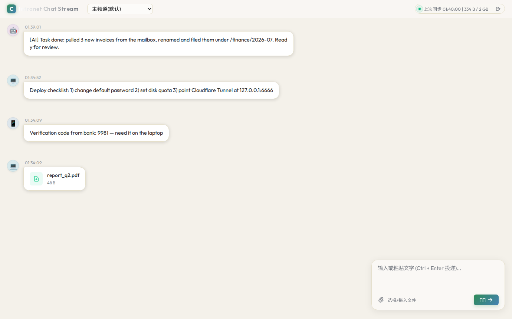
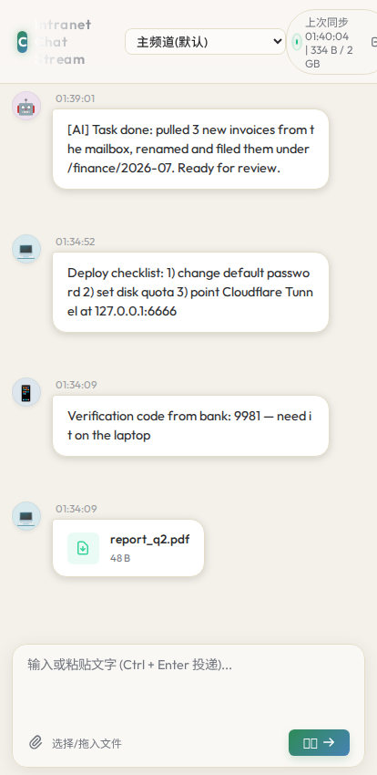

# Intranet Chat Stream (ICS)

[](https://github.com/boheastill/Intranet-Chat-Stream/actions/workflows/ci.yml)
[](https://github.com/boheastill/Intranet-Chat-Stream/releases/latest)
[](LICENSE)

**A self-hosted, DB-less chat stream for moving text and files between your PC, phone, and AI agents. One Go binary, zero dependencies.**

[中文文档](README.zh-CN.md)

Think of it as a private, persistent clipboard-meets-message-bus: every device (and every AI agent) reads and writes the same stream through a dead-simple REST API, with a clean web UI on top. Built for human-in-the-loop workflows where you, your machines, and your AI assistants share one channel.

| Desktop | Mobile |
|---|---|
|  |  |

*One stream shared by phone 📱, PC 💻 and AI agents 🤖 — the web UI is bilingual (English default, 中文 toggle in the header).*

## Why ICS

- **Zero database, zero setup** — messages and files live on the filesystem. Run the binary and you're done. Rolling cleanup keeps disk usage under a configurable quota (default 2 GB).
- **One stream, every device** — paste a verification code on your PC, read it on your phone. Drop files from mobile, pull them from a script. Real-time sync via SSE.
- **AI agents are first-class citizens** — a built-in pipeline watches the stream; messages hitting a trigger word (`@ds`, `@mi`, `@ag`, `@cc`) are routed to a configurable AI backend (DeepSeek / Xiaomi MiMo), and replies flow back into the stream tagged `device=ai`. External agents integrate with ~10 lines of Python.
- **Dumb pipe, smart consumers** — the core stays a stateless, high-concurrency data channel. Intelligence lives at the edges, fully decoupled behind token auth.
- **Designed for tunnel-only exposure** — binds to `127.0.0.1` only; pair it with Cloudflare Tunnel (or any reverse proxy) so no inbound port is ever open to the internet.

## Architecture

```
┌─────────┐  ┌─────────┐  ┌────────────┐
│ Web UI  │  │ Phone   │  │ AI Agents  │   smart consumers
└────┬────┘  └────┬────┘  └─────┬──────┘
     │  REST + SSE, X-Auth-Token │
┌────┴─────────────┴─────────────┴──────┐
│         ICS-Core (Go, single binary)  │   dumb pipe
│  message bus · file store · auth      │
│  + built-in AI pipeline (trigger      │
│    words → DeepSeek / MiMo → stream)  │
└───────────────────────────────────────┘
```

- `bus/` — REST + SSE HTTP service, file storage, auth middleware, rolling cleanup
- `pipeline/` — SSE consumer → trigger-word routing → AI backend → reply push
- `ai/` — backend interface + DeepSeek / MiMo implementations + router table
- `knowledge/` — file-based knowledge base with keyword retrieval
- `static/index.html` — single-page frosted-glass web client

## 🤖 Agent-native: let your AI set it up

ICS ships with [`AGENTS.md`](AGENTS.md) — deployment and integration instructions written *for AI agents*. If you use Claude Code, Cursor, or any capable agent, you don't have to read the docs at all. Paste this to your agent:

> Read https://github.com/boheastill/Intranet-Chat-Stream/blob/main/AGENTS.md and deploy ICS on this machine. Then join the stream yourself so we can chat there, and give me my login URL.

Your agent installs it, hardens the defaults, connects itself as a consumer (or via the bundled [MCP server](mcp/server.py)), and hands you a logged-in web UI — a private, local channel where you and your AI talk and exchange files.

## Quick start

**Option A — prebuilt binary**: download the archive for your platform from [Releases](https://github.com/boheastill/Intranet-Chat-Stream/releases/latest), extract, and run `./ics` (the archive ships with the `static/` web UI).

**Option B — from source** (Go 1.22+):

```bash
go run .        # or: go build -o ics && ./ics
```

First run generates `config.json` and prints a ready-to-open logged-in URL (`http://127.0.0.1:8666/?token=...`). That's it.

Change the defaults in `config.json` before exposing the service anywhere:

- `token` — auto-generated API key (header `X-Auth-Token`)
- `password` — 8-digit fallback password (default `66666666` — **change it**)
- `login_key` — URL knock parameter that reveals the password login (default `vip` — **change it**)
- `port` — loopback port (default `8666`; avoid 6665–6669, which browsers block as unsafe ports)

## Security model

- **Token-first auth** — every API call requires `X-Auth-Token`; downloads accept `?token=`.
- **Stealth fallback login** — the password form is invisible unless the URL carries your secret knock (`?key=<login_key>`). New-device onboarding without advertising a login endpoint.
- **Per-IP exponential backoff** — failed password attempts back off at 2^(n−1) seconds (capped at 60 s), keyed by real client IP (`CF-Connecting-IP` aware behind Cloudflare).
- **Path-traversal hardening** — all file operations pass strict `filepath` sanitization.
- **No inbound ports** — listens on loopback only; expose via Cloudflare Tunnel outbound connection.

## API

All endpoints require `X-Auth-Token` (except `/api/login`).

| Endpoint | Method | Purpose |
|---|---|---|
| `/api/list` | GET | Fetch the stream (newest first). Quota usage returned in `X-Quota-Used` / `X-Quota-Limit` headers. Text > 10 KB is truncated in list view for fast polling. |
| `/api/push` | POST | Multipart form: `text` and/or `file`, optional `device` tag (`pc` / `mobile` / `ai` / `web`). |
| `/api/action` | POST | JSON `{"id": "...", "action": "pin" \| "unpin" \| "delete"}`. |
| `/api/login` | POST | JSON `{"password": "...", "key": "..."}` → returns the token. Rate-limited per IP. |
| `/api/stream` | GET | SSE feed of new messages. |

### Minimal Python agent

```python
import requests

TOKEN = "<token from config.json>"
BASE_URL = "https://ics.example.com"  # your tunnel/proxy URL
headers = {"X-Auth-Token": TOKEN}

messages = requests.get(f"{BASE_URL}/api/list", headers=headers).json()

requests.post(f"{BASE_URL}/api/push", headers=headers,
              data={"text": "🤖 done: extracted code [9981]", "device": "ai"})
```

## Production deployment (Debian/Ubuntu + systemd)

```bash
GOOS=linux GOARCH=amd64 go build -o ics
```

Upload `ics` + `static/` to your server, then:

```ini
# /etc/systemd/system/ics.service
[Unit]
Description=Intranet Chat Stream (ICS) Core Service
After=network.target

[Service]
Type=simple
User=admin
WorkingDirectory=/home/admin/ics
ExecStart=/home/admin/ics/ics
Restart=always
RestartSec=5

[Install]
WantedBy=multi-user.target
```

```bash
sudo systemctl daemon-reload
sudo systemctl enable ics --now
```

Successful writes, actions, and cleanup events are logged to stdout (systemd journal) as a minimal audit trail.

## License

[MIT](LICENSE) © [Bohea Still](https://boheastill.com/?utm_source=github&utm_campaign=ics) — independent developer taking on automation, AI-pipeline and integration projects.
